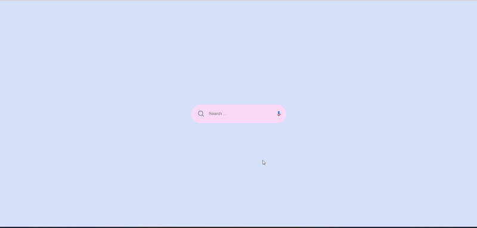
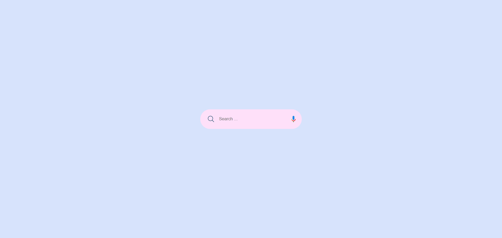

# 🔍 SearchFlow: Animated Web Search Experience

SearchFlow is a sleek, modern animated web search bar designed to enhance user interaction through smooth transitions and engaging UI animations. Perfect for personal portfolios, landing pages, and any modern web interface that requires a clean and interactive search experience.

## 🚀 Profile 
<a href="https://www.linkedin.com/in/dharmendraverma95/" target="_blank">🧑‍💻 LinkedIn Profile </a> | <a href="https://www.behance.net/dhirukumar" target="_blank">🧑‍💻 Behance Profile </a>

## ✨ Features

- Responsive and lightweight design
- Smooth CSS animations and transitions
- Expanding search input on focus
- Optional icon animations and hover effects
- Fully customizable with CSS variables

## 🛠️ Built With

- HTML5
- CSS3 (with keyframe animations and transitions)
- JavaScript (for interactivity, optional)

## 📁 Folder Structure

searchflow/
│
├── index.html # Main HTML page
├── images [ all images ]
├── style.css # Stylesheet for animations and layout
├── script.js # (Optional) JavaScript for interaction
└── README.md # Project documentation

## ⚙️ How to Use

1. Clone or download the repository.
2. Open `index.html` in your browser to view it locally.
3. Customize the CSS and animation timing to fit your project's needs.

#### 💡 Customization Tips
- Change the animation duration using transition in CSS.
- Replace icons with your preferred SVG or font icons.
- Add search functionality using JavaScript or connect to a backend.

👉 Desktop Design 

📸 Desktop Design 
